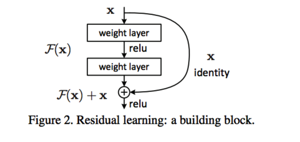

# Summary-of-Deep-Learning
## ImageNet
- スタンフォード大学のFei Fei Leeさんが創始したWeb Site. 数1000万枚のタグをつけた画像を世界中に公開している。
- これがなかったらDeep Learningの躍進はなかった。
- http://www.image-net.org/

## ILSVRC(ImageNet Large Scale Virtual Recognition Challenge)

## Object Location

- ImageNetが毎年開催しているコンペ。2012のalexnetで初めてDeep Learningが使われ大注目に。
- http://www.image-net.org/challenges/LSVRC/

### AlexNet(2012)
- CNNのシンプルなモデル。今でも単純な分類にはよく使われるモデル。よく本で勉強ででくるのはここまで。  

### VGG(2014)
- 2014 ILSVRCコンペで惜しくも2位だったが、シンプルな構造のため、事実上一番使われているモデル。学習済みのデータを転移学習として利用される。

- Alexnetとの比較。単純に層が深くなっただけ。

### GoogLeNet(2014) Google
- 深ければ深いほど認識率は上がるが、学習がすすまない。層間をスキップさせるなどして工夫する必要がある。

### ResNet(2015) Microsoft
- スキップを大幅に増やして、多層であっても学習できるように工夫したモデル。人間を超えたと言われる。

## Object Detection
- ILSVRCではObject LocationとObject Detectionがあるが、最近はObject Detectionが注目されている。
- いいまとめ記事があったのでこっちを参考
- http://tech-blog.abeja.asia/entry/object-detection-summary

### R-CNN
- R-CNNは前段でパターン検出などの既存の画像検知をすることにより、候補を抽出し、後段でDLを使うことにより物体検出をしている。

- 前段からDLで実現するものにしたものがfaster-RCNN。精度は高い。

### SSD
- R-CNNの問題は、検出速度が早くないこと。SSDは細かくマスに分けることで、矩形の候補と物体検出を精度と速度を両立したもの。
- SSDはTensorflowが学習済みデータを公開しており、環境によっては、数10msで検知できるなどすでに実用的。
- 下記のudacityのチュートリアルで実際動作させられる。  
    - https://github.com/HidetoKimura/carnd_object_detection
- GoProもどきの画像をInputした結果  
    - https://drive.google.com/open?id=1ejDvcKkAvApTcZvyfneJiag8OE8xnKr1

### FCN
- 矩形検出ではなく、pixelごとにどのものを表しているのかを学習さえ画像自体を分類してしまうもの
- これを使えば画像にマスクをかけられるようになるので、車なのか人なのか道路がはっきり区別できるようになる。矩形だと判定に誤差が大きい。
- 下記のudacityのprojectで実際動作させられる。  
    - https://github.com/HidetoKimura/carnd_semantic_segmentation

